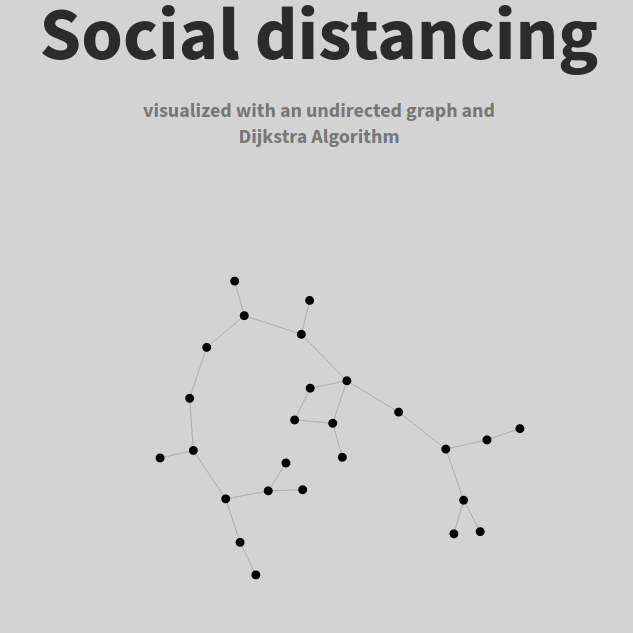

# The Pandemic Hack
<p align="center"></p>

<p align="center">This is a small project where I wanted to apply my newly learned knowledge on DataStructures and Javascript. <br>The goal is to underline the importance of social distancing during a pandemic. </p> 

<hr style=" border: 0; height: 1px; background-image: linear-gradient(to right, rgba(0, 0, 0, 0), rgba(0, 0, 0, 0.75), rgba(0, 0, 0, 0));">

This is the first half of the project, the second half consists in calculating the probability of getting infected during a pandemic; it is <b>coming soon</b>.

## Requirements

* NodeJS
* npm (node package manager)
* Express

## Run

#### Dependencies
[NodeJS and npm](https://nodejs.org/en/download/)

Check your installations in a terminal window with:

```
node -v
```

```
npm -v
```

it should be enough doing:
```
npm install
```
to install everything you need, in case of need try to install Express manually:

```
npm install express
```

The package.json should be already present in the "src" folder.

#### Run the project

I reccomend you to start the server which is needed only if you want to land on the home page of the project with an explaination:

```
node server.js
```

and then visit http://localhost:8080

Please take a look there, you will find some documentation on the project.

#### Running your own simulation

There's some pre-compiled data in this project, which means I've already run a simulation and built the network of individuals. It is just an example with the alphabet letters, you can easily start your own by following these steps.

Modify <b>only</b> the main.js file inside the "core" folder. At line 10 you will find:

```javascript
let name_set = "ABCDEFGHIJKLMNOPQRSTUVWXYZ";
```

Modify this and add your own individuals of the network.

Modify:

```javascript
max_conn_number = 1;
```

If you want to add more random connections for each node.  
Note that the value is 1 by default but it doesn't mean that every node has only one connection!

Change the range in:

```javascript
connected = graph.addEdge(population[i], possible_conenctions[candidate_indx], Math.floor(Math.random() * 5) + 1);
```

If you want to modify the weight of the edges (links or connections), higher value means less frequent contact between individuals which also means a longer period of infection for the disease.

Finally run 
```
node ./core/main.js
```

It will run the simulation involving creating an undirected graph and traversing the shortest path with Dijkstra Algorithm. Make sure to read the documentation by starting the server! 

## Result

The code will generate a file called "social-net.json" and eventually "[PLOT]social-net.json" if you decide to run the convert_data function when prompted to do so, which re-organizes your newly created JSON network for plotting. The plot.js file works with this kind of format.

These files represent the network of individuals with their respective edges. The "PLOT" is just a more polished data set for plotting.  
Note that the visualization on the landing page is pretty simple. Nothing really fancy going on there. I'm very new to web development!

### Notes

The landing page is <b>optimized for "half window" reading</b>.

Virus icons made by https://www.flaticon.com/authors/freepik from https://www.flaticon.com/, full repo icon by me.

Code for graph visualization taken from https://bl.ocks.org/mbostock/2675ff61ea5e063ede2b5d63c08020c7 and adapted to my project by me.

#### More stuff

The study I am currently following for the second half of the project is located in the documentation folder.

In there you will also find a small explaination of the Dijkstra Algorithm made by me.
