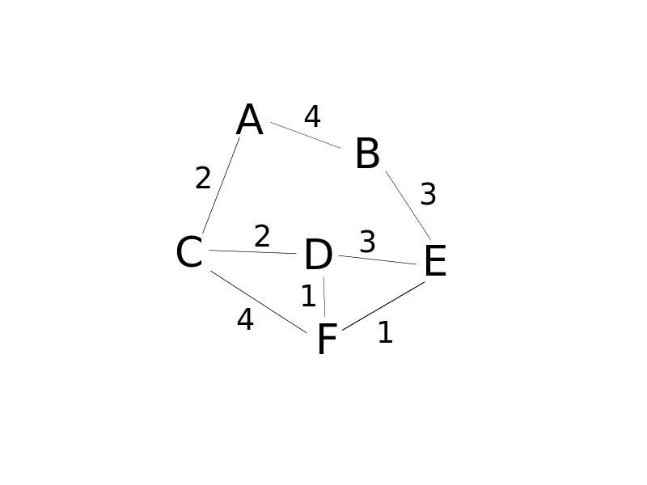

# Dijkstra Algorithm

This algorithm is used to find the shortest path between two vertices on a graph.

"What's the fastest way to get from A to B?"

## Use cases

* GPS - finding fastest route
* Network routing
* Biology - used to model the spread of a disease among humans
* Many more

## Walkthrough

This algorithms applies to a [weighted graph](https://en.wikipedia.org/wiki/Graph_(discrete_mathematics)#Weighted_graph).

<ol>
    <li>Every time we visit a node we pick the one with the smallest known distance to visit first.</li>
    <li>Once we moved to that node we visit all of its 'neighbors' (nodes)</li>
    <li>For each neighboring node we calculate the distance by summing the total edges that lead to the node we're checking from the starting node</li>
    <li>If the new total distance to a node is less than the previous total, we store the new shorter distance for that node. </li>
</ol>

The first thing we do is to initialize the distance from the starting node to the other nodes to Infinity, since we don't know the distance. We set the distance from the starting node to itself to 0.

We pick a node and check the distance between that node and the starting point. We repeat this for all neighbors of that node.
We find the smallest distance and we pick the node with that distance.

We repeat the process for the newly selected node keeping track of the nodes we visited. We also remember the shortest path that got us there.

Every time we obviously sum up all the paths values, going "deep" into the graph means longer paths.

Once we visited all the nodes and we arrived at the target node we are done! We calculate the path backwards and we print the path.

Here's an example from A to E.

### Further readings
A more detailed [explaination](https://en.wikipedia.org/wiki/Dijkstra%27s_algorithm)